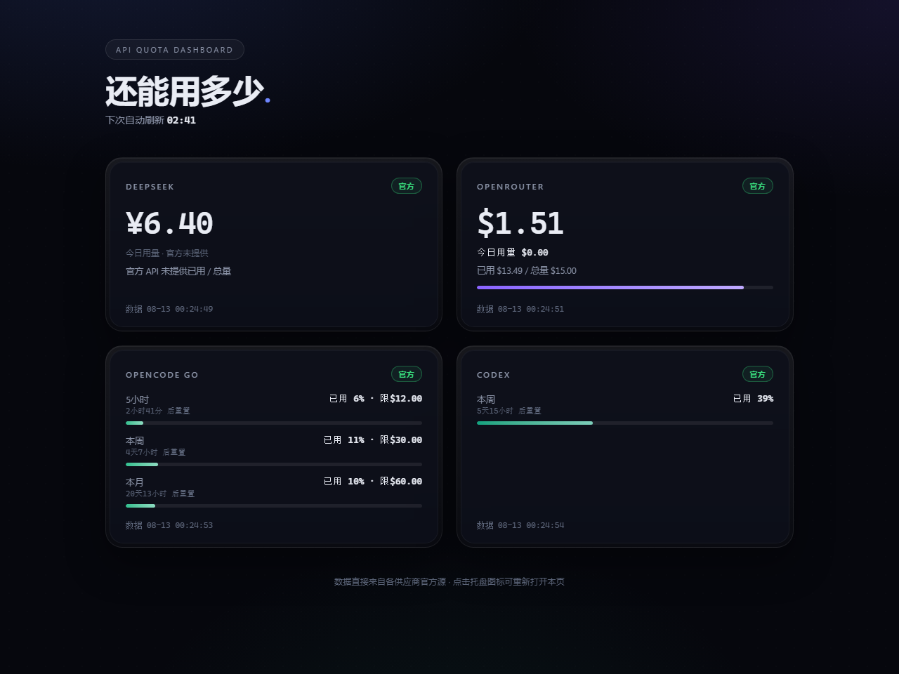

# API 配额仪表盘（API Quota Dashboard）

同时用 DeepSeek、OpenRouter、OpenCode Go 和 Codex，余额与使用限额却散在四个地方。开始长任务前，你很难一眼知道哪个服务的额度还充足。这个 Windows 托盘工具把**余额和剩余额度集中到一页**，点图标就能看；数值直接来自各家的**官方数据源**，拿不到就如实显示不可用。

Using several AI services? Check DeepSeek/OpenRouter balances and OpenCode Go/Codex usage limits in one Windows tray dashboard before starting a long task. Values come from official sources; unavailable data is shown as unavailable.

---

## 功能 / Features

- 托盘常驻，后台定时刷新（默认 3 分钟，可配），单供应商失败不影响其他
- 点击托盘图标 → 打开浏览器仪表盘（本地 `127.0.0.1`，仅本机可访问），页面每 15s 自动拉取，每秒倒计时
- 打开即强制刷新，保证看到最新官方数据
- 失败降级：保留最近一次官方数据并标注「刷新失败·旧数据」；从未成功过则如实显示「官方数据源不可用」
- 可选开机自启：`python install_autostart.py register`
- 无界面验证：`python main.py --selftest`

- Tray-resident, auto-refresh (default every 3 min, configurable); one provider failing doesn't affect the others
- Click the tray icon → browser dashboard (local `127.0.0.1`, localhost only); the page pulls every 15s with a per-second countdown
- Force-refresh on open, so you always see the latest official data
- Graceful degradation: keeps the last official data marked 「刷新失败·旧数据」; if never succeeded, shows 「官方数据源不可用」
- Optional autostart: `python install_autostart.py register`
- Headless check: `python main.py --selftest`

## 截图 / Screenshots



界面为暗色玻璃拟态四卡：DeepSeek（余额 ¥）· OpenRouter（余额 $ / 已用 / 总量 / 今日）· OpenCode Go（5小时 / 本周 / 本月 百分比 + 重置倒计时）· Codex（5小时 / 本周 / 本月 百分比 + 重置倒计时）。

A dark-glass four-card dashboard: DeepSeek (CNY balance) · OpenRouter (USD balance/used/total/today) · OpenCode Go (rolling/weekly/monthly % + reset countdown) · Codex (rolling/weekly/monthly % + reset countdown).

## 安装 / Install

需要 Windows + Python 3.9+（开发于 3.11）。

```bash
cd apiquota-dashboard
pip install -r requirements.txt
```

Requires Windows + Python 3.9+ (developed on 3.11).

## 运行 / Run

```bash
# 1) 复制配置模板并填入自己的 key
copy config.example.yaml config.yaml
# 2) 启动托盘
python main.py
# 3) 无界面验证（跑一轮刷新打印结果后退出）
python main.py --selftest
```

开机自启：`python install_autostart.py register`。退出：托盘右键 → 退出。

## 各供应商配置 / Per-provider setup

所有 key 都填在 `config.yaml`（已 `.gitignore`，绝不提交）。模板见 `config.example.yaml`。

### 1. DeepSeek（余额）
- 控制台：https://platform.deepseek.com → API Keys 创建 `sk-...`
- `api_key` 填进去；`proxy` 留空（DeepSeek 域内直连）
- 官方接口：`GET https://api.deepseek.com/user/balance`（官方 API 不提供「今日用量」）

### 2. OpenRouter（credits 余额）
- 控制台：https://openrouter.ai/settings/keys → 创建 `sk-or-v1-...`
- 海外接口需走代理：`proxy: "http://127.0.0.1:7897"`（Clash 默认端口，可按你的代理改；不需要代理就留空）
- 官方接口：`GET https://openrouter.ai/api/v1/credits`（余额 = total_credits − total_usage）

### 3. OpenCode Go（订阅额度）—— 重点：cookie 怎么填
OpenCode Go **没有公开的用量查询 API**，官方唯一用量源是登录态控制台页。一次性配置：

1. 用浏览器登录 https://opencode.ai ，打开你自己的用量页（URL 形如 `https://opencode.ai/workspace/<你的workspaceId>/go`）
2. 按 **F12 → Network** → 刷新页面 → 点任意一个请求 → 复制请求头里的完整 **Cookie** 值
3. 把整段 Cookie 粘到 `config.yaml` 的 `opencode_go.cookie`，把用量页地址填到 `opencode_go.usage_url`
4. 程序带 cookie 请求官方用量页，解析官方页面内嵌的 5小时 / 本周 / 本月 已用百分比 + 重置倒计时

⚠️ cookie 会过期：失效时卡片显示「官方数据源不可用」，重新复制一份即可。批量更新工具：`python update_opencode.py "<新cookie>" "<新用量页URL>"`。

### 4. Codex（ChatGPT 订阅额度）—— 走登录态，不需要 key
- **不需要 API key**。认证 = Codex CLI 在本机的登录态 `~/.codex/auth.json`（先在本机跑过 `codex` 登录即可，程序**只读**该文件，绝不写回）
- 官方接口：`GET https://chatgpt.com/backend-api/wham/usage`（用 auth.json 的 OAuth access_token + account_id 头）
- `codex.auth_path` 留空 = 默认 `~/.codex/auth.json`；token 过期时重跑 `codex` 登录即可

### 常见问题 / FAQ

- **某个供应商显示「官方数据源不可用」**：先看卡片上的原因。常见：key 填错 / cookie 过期 / 代理没开 / 未登录 codex。单个供应商失败不影响其他三张卡。
- **需要代理吗？** OpenRouter / OpenCode Go / Codex 的接口在海外，一般需要代理；DeepSeek 不用。在 `proxy` 填你的代理地址，不需要就留空。
- **会不会改动我的本地设施？** 不会。程序只发起官方 HTTP 请求；不读不写本地代理端口/日志，不改 `~/.codex/auth.json`（只读）。
- **打开仪表盘很慢？** 打开时强制刷新一轮；若某供应商请求超时（如 chatgpt.com 偶发超时），程序自动重试并保留旧数据。

- **A card shows 「官方数据源不可用」**: check the reason on the card — wrong key / expired cookie / proxy off / codex not logged in. One failure never blocks the others.
- **Is a proxy required?** OpenRouter / OpenCode Go / Codex endpoints are overseas and usually need a proxy; DeepSeek does not. Set `proxy` to your proxy address, or leave it empty.
- **Does this touch my local setup?** No. It only makes official HTTP calls; it never reads/writes local proxy ports or logs, and never modifies `~/.codex/auth.json` (read-only).
- **Dashboard slow to open?** It force-refreshes on open; if a provider times out (e.g. chatgpt.com occasionally does), it retries and keeps the last data.

## 数据来源 / Data sources

| 供应商 | 计费类型 | 官方数据源 |
|---|---|---|
| DeepSeek | balance | `GET https://api.deepseek.com/user/balance` |
| OpenRouter | balance | `GET https://openrouter.ai/api/v1/credits` |
| OpenCode Go | subscription | 登录态控制台用量页（`cookie` + `usage_url`） |
| Codex | subscription | `GET https://chatgpt.com/backend-api/wham/usage`（`~/.codex/auth.json` 登录态） |

数据真实性铁律：展示数值必须直接来自官方响应；解析失败 / 未配置 / 非 200 → 如实显示「官方数据源不可用」，绝不硬编码、绝不编数字。详见 `docs/数据源确认.md`。

All values come straight from official responses; any parse failure / missing config / non-200 shows 「官方数据源不可用」 — no hardcoding, no fabrication. See `docs/数据源确认.md` for details.

## 目录结构 / Layout

```
main.py                 # 入口：config → QuotaStore → 调度 → 托盘
config.py               # 配置加载与归一化（脱敏打印）
scheduler.py            # 后台定时刷新 + 失败降级（保留旧数据）
providers/              # 各供应商数据源（quota.py 统一模型）
  deepseek.py           # DeepSeek 官方余额
  openrouter.py         # OpenRouter credits
  opencode_go.py        # OpenCode Go 登录态用量页解析
  codex.py              # Codex wham/usage（读 ~/.codex/auth.json）
dashboard_ui/           # 浏览器仪表盘（本地 HTTP + 前端页面）+ 托盘
install_autostart.py    # 开机自启 register/unregister/status
update_opencode.py      # 批量更新 OpenCode Go cookie/usage_url
docs/                   # 调研 / 数据源确认 / screenshot.png
LICENSE                 # MIT
```

## License

MIT — see [LICENSE](LICENSE).
